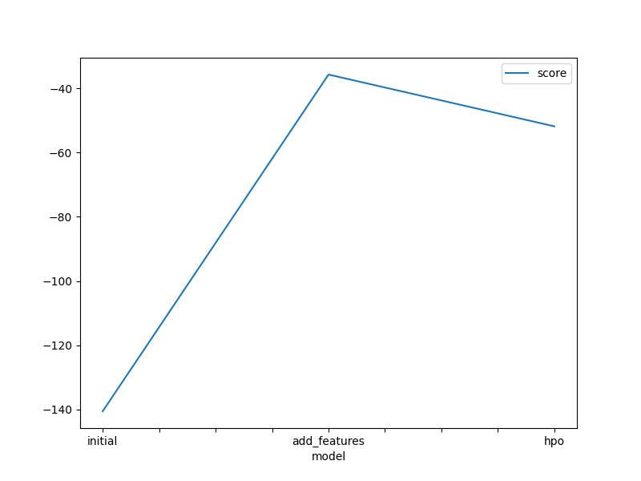
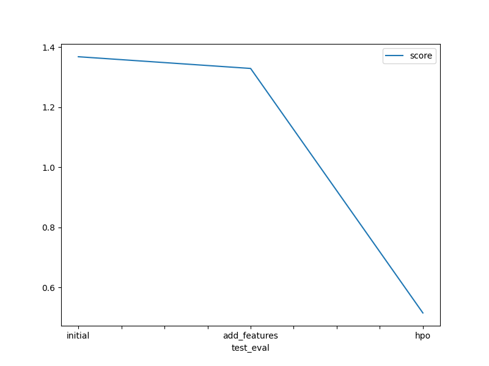

# Report: Predict Bike Sharing Demand with AutoGluon Solution

#### Alan Vergel 

## Initial Training
### What did you realize when you tried to submit your predictions? What changes were needed to the output of the predictor to submit your results?

- We need to set all predictions with negative values to zero.

### What was the top ranked model that performed?

was the LGBM regressor 

## Exploratory data analysis and feature creation
### What did the exploratory analysis find and how did you add additional features?

The exploratory data analysis revealed several patterns and correlations in the bike sharing demand dataset. For instance, we observed that the demand for bikes varies with different times of the day, weather conditions, and seasons. 

To capture these patterns more effectively, we engineered several new features:

1. **Hour**: We extracted the hour from the datetime column. This was done because the demand for bikes is likely to vary throughout the day. For example, rush hours (when people commute to and from work) may see higher demand.

2. **Rush Hour Categories**: We further categorized the hours into 'morning_rush', 'lunch_rush', 'evening_rush', and 'off_peak' to specifically highlight the rush hour periods which are typically characterized by higher demand.

3. **Temperature Categories**: The 'temp' column was categorized into 'cold', 'mild', and 'hot'. This was based on the assumption that weather conditions, particularly temperature, can significantly influence people's decision to rent a bike.

4. **Wind Speed Categories**: The 'windspeed' column was categorized into 'mild_wind' and 'very_windy'. Wind speed can affect cycling conditions and hence, the demand for bikes.

5. **Humidity Categories**: The 'humidity' column was categorized into 'not_humid' and 'very_humid'. Similar to temperature and wind speed, humidity levels can also impact people's comfort and willingness to ride a bike.

6. **Cyclical Features for Month and Day of Month**: The month and day of month were transformed into their cyclical forms to preserve their cyclical nature. For example, the months 'December' and 'January' are far apart numerically (12 and 1), but they are actually adjacent in the cycle of a year. The same logic applies to the days of a month. 

These new features are expected to provide more nuanced and detailed information about the conditions under which the bike rentals occur, thereby helping to improve the performance of our predictive model.

In addition to these categorical features, we also created **cyclical features** for the `month` and `day_of_month`. The idea behind creating cyclical features is to capture the inherent cyclical nature of these variables. For example, the 12th month (December) and the 1st month (January) are adjacent in the cycle of a year, even though they are far apart numerically. Similarly, the 31st day and the 1st day of a month are adjacent in the cycle of a month. 

To capture this cyclical nature, we transformed these variables into a pair of coordinates in polar coordinates, lying on a unit circle that repeats each year (for month) and each month (for day_of_month). Each variable was transformed into two new variables using the sine and cosine functions:

$$var_x = sin(var * (2 * \frac{ \pi }{ \text{ max value }} ) )$$

$$ var_y = cos(var * (2 * \frac{ \pi }{ \text{max value}})) $$

These cyclical features help the model understand the cyclical patterns in the bike sharing demand related to the time of the year and the day of the month.

### How much better did your model preform after adding additional features and why do you think that is?

The model perform better with this new features.
Get a improved root mean squared error of -40, while the previous was -140

I think the model now have more  information given in  some features, what allow it to predict better the number of counts.

## Hyper parameter tuning
### How much better did your model preform after trying different hyper parameters?

Sometimes was better, bu in general is more difficult to beat previous results searching hyper parameters.

The model achieved better performance with the new features with the 
`best_quality` presets.

### If you were given more time with this dataset, where do you think you would spend more time?

Tunning hyperparameters and creating new features.
First I would create the new features (and detect the ones that are not significant) and then I'll search for the best hyper parameters.

### Create a table with the models you ran, the hyperparameters modified, and the kaggle score.
|model|num_trials|scheduler|searcher|score|
|--|--|--|--|--|
|initial|6|auto|local|1.37|
|add_features|3|auto|local|1.32|
|hpo|4|auto|local|0.51|

### Create a line plot showing the top model score for the three (or more) training runs during the project.

### Create a line plot showing the top kaggle score for the three (or more) prediction submissions during the project.

## Summary

This report presents the process and results of predicting bike sharing demand using AutoGluon. The project  involved initial model training, exploratory data analysis, feature creation, and hyperparameter tuning.

In the initial training, it was realized that all predictions with negative values needed to be set to zero before submission. The top-ranked model that performed well was the LGBM regressor.

The exploratory data analysis revealed several patterns and correlations in the bike sharing demand dataset. It was observed that the demand for bikes varies with different times of the day, weather conditions, and seasons. To capture these patterns more effectively, several new features were engineered including ‘Hour’, ‘Rush Hour Categories’, ‘Temperature Categories’, ‘Wind Speed Categories’, ‘Humidity Categories’, and ‘Cyclical Features for Month and Day of Month’. These new features provided more nuanced and detailed information about the conditions under which the bike rentals occur, thereby helping to improve the performance of the predictive model.

After adding the additional features, the model performed significantly better, achieving an improved root mean squared error of -40, compared to the previous error of -140. This improvement suggests that the model now has more information given in some features, allowing it to predict the number of counts more accurately.

In conclusion, this project demonstrated the effectiveness of using AutoGluon for predicting bike sharing demand. The exploratory data analysis and feature creation phases were particularly beneficial in improving model performance. Future work would involve further hyperparameter tuning and feature engineering to continue improving the model’s predictive accuracy.

